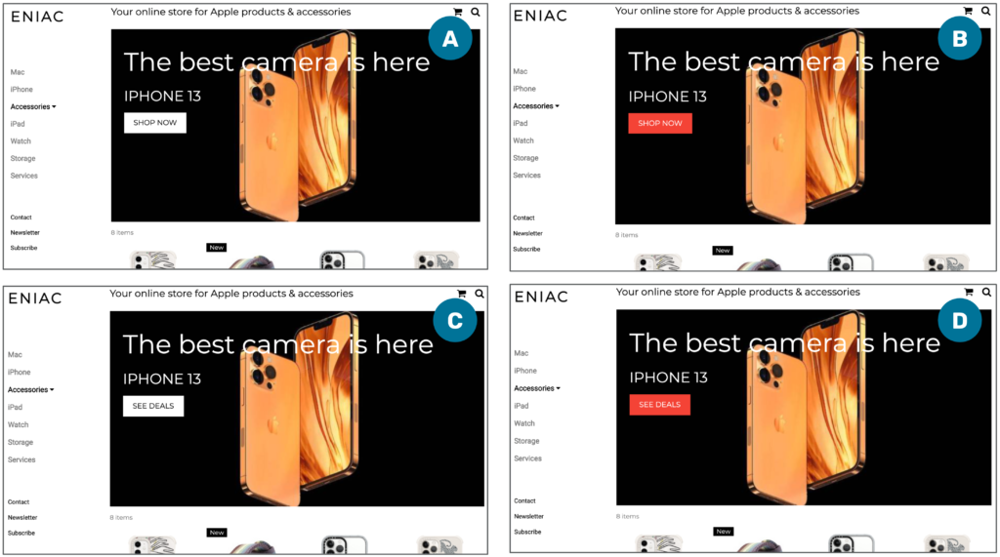
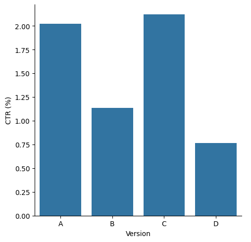

# Eniac A/B Testing — Homepage Conversion Optimization  
**Python: Pandas, SciPy & Seaborn | WBS Data Science Bootcamp Project**

---

## Project Overview

This project is a business-driven A/B testing case study conducted as part of the WBS Data Science Bootcamp.  

The objective was to help Eniac, a European e-commerce company, evaluate whether redesigning the homepage’s primary call-to-action button would significantly improve user engagement and increase click-through rate (CTR).

The homepage receives substantial traffic (~7,000 daily visits), yet only around 2% of users click the main “SHOP NOW” button promoting the iPhone 13. Because this step represents the top of the purchase funnel, even small improvements could meaningfully impact downstream sales.

The UX team proposed three alternative button designs. The Data Analytics team was tasked with determining, through statistical testing, whether any variant significantly outperformed the original.

The final outcome is a data-driven recommendation based on hypothesis testing and behavioral metrics.

---

## Business Context

Eniac’s purchase funnel shows a major drop-off at the very first interaction:

- ~50,000 weekly homepage visits  
- ~1,000 clicks on the featured button  
- ~30 completed iPhone purchases  

While later funnel steps perform relatively well, the homepage button represents a high-leverage optimization opportunity.

Four versions were tested:

- **Version A** — White “SHOP NOW” (Original)  
- **Version B** — Red “SHOP NOW”  
- **Version C** — White “SEE DEALS”  
- **Version D** — Red “SEE DEALS”  

The experiment ran for 14 days (Nov 2 – Nov 16, 2021) to cover two full business cycles.

---

## Experimental Design

### Primary Metric

**Click-Through Rate (CTR)**  

CTR = Clicks / Total Homepage Visits  

A statistically significant difference in CTR was required to declare a superior variant.

### Secondary Metrics

- Drop-off rate (users who initiate but do not complete a process)  
- Homepage-return rate (users returning to homepage after clicking)  

These metrics provided additional behavioral context beyond raw click performance but were not included in the analysis.

---

## Hypotheses

**Null Hypothesis (H₀):**  
All four versions have equal click-through rates. Observed differences are due to chance.

**Alternative Hypothesis (H₁):**  
At least one version has a different click-through rate.

- Significance level (α): 0.05 (95% confidence)  
- Minimum Detectable Effect (MDE): 20%  
- Statistical Test: Chi-Square Test of Independence  
- Post-hoc method: Pairwise comparisons with Bonferroni correction for multiple tests  

---

## Tools Used

**Python (Pandas & NumPy)**  
Used for data preparation, and CTR calculation.

**SciPy**  
Used to perform chi-square tests and pairwise post-hoc testing.

**Seaborn**  
Used to visualize CTR differences across variants.

**Jupyter Notebook**  
Fully documented notebook containing the complete analytical workflow.

---

## Project Files

### `notebooks/`

Contains the complete analysis, including:

- Data preparation 
- CTR calculation per variant  
- Contingency table construction  
- Chi-square testing  
- Post-hoc pairwise comparisons  
- Interpretation of results  

### `data/`

Contains raw experimental data.

---

## Summary of Key Insights

### Color Had a Strong Negative Impact  

Both red button variations (B and D) showed lower click-through rates compared to the white versions.

### No Significant Difference Between A and C  

Although Version C (“SEE DEALS”) showed strong performance, post-hoc testing revealed **no statistically significant difference between Version A and Version C**.

### Original Version Remains Competitive  

Since Version A (original) performed as well as Version C and significantly better than red variants, there is no statistical justification for changing the current homepage button.

### Behavioral Metrics Supported the Conclusion  

Secondary metrics did not provide compelling evidence that alternative variants would improve overall user engagement quality.

---

## Recommendation

Continue using **Version A (White “SHOP NOW”)**.

While some variants appeared numerically different, statistical testing shows:

- Redesigning the button does not produce a statistically meaningful improvement over the current version.  
- Implementing changes without clear statistical evidence could introduce unnecessary risk without guaranteed business benefit.  

Future optimization efforts should focus on:

- Other high-leverage points in the funnel  
- Testing broader UX changes  
- Evaluating downstream conversion metrics (e.g., completed purchases)  

---

## Limitations & Considerations

- The analysis focuses on CTR, not final revenue impact.  
- Version B lacked complete secondary metric tracking.  
- The experiment isolates a single UI element; broader behavioral effects were not tested.  
- Results reflect the specific time period and traffic composition of the experiment.  

---

## Overall Takeaway

- Data-driven experimentation prevents unnecessary product changes.  
- Statistical significance is essential before implementing UX redesigns.  
- Not every redesign improves performance — sometimes the optimal decision is maintaining the status quo.  
- A/B testing is most valuable when tightly aligned with measurable business outcomes.
